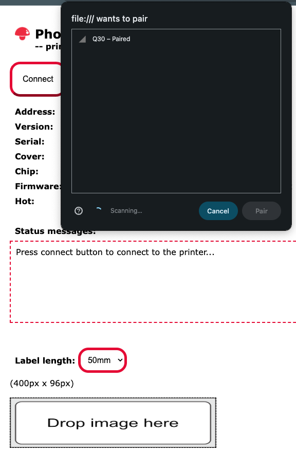
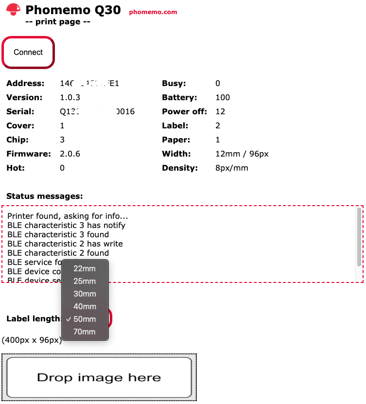

## Phomemo Thermal Printer Web Print Tool

### Motivation

  Phomemo Q30 is a nice, inexpensive, portable thermal printer but there are several issues that nobody explains before you buy it:
  
  - The app you need is available only on mobile devices so screen size and fingers are definitely limiting factors
  - While the app is said to be free, the advance usage of the app, like using icons, expires after a period of time
  - The printer has BT connection but it is not possible to connect it to your PC
  - There is no option to normaly use your favorite paint program and keep your own archive of created labels

### Project

  This project ATM implements support for printing directly from a web page:

  - Press connect button and allow browser to pair with Q30 using BT
  - Select label size from the drop down
  - Drop a browser supported black and white image with the specified resolution
  - Press print

  

  

  The web page is written in a simple vanilla JS and can be hosted or even opened directly from a local hard drive. By using a favorite paint program and layers you can keep a single project with all the labels and create/modify/export them as png, for instance. Then a direct drop into the page allows you to print your label.

### Challenges

 There is no official support nor documentation by Phomemo. All requests for information or additional application were politely declined with "not available at this time". Having this in mind, the project is reverse engineered protocol in between the mobile and the printer. Some of the commands and events are probably skipped or not available.

 If you encounter any issues look at the config.js and try adjusting "mtu" or "interval" parameters. These are BT options which can influence the reliability of the communication with the printer. You can also enable logging and check the printer responses.

 ### Future
 
 The project is focused on Phomemo Q30, atm. Other thermal printers could be added. We do not own other devices but the protocol should be similar and the effort of adding other printers should not be as big as this initial work.

### Disclaimer

 This project is a personal tool and while it can be perfectly suitable for one it could be wrong, non functional or even damaging for the other. You can use this software entirely or its parts or modify it as you wish. But in no circumstances will the developers be responsible for consequences of using it.

 The developers are in no way connected to Phomemo company.
